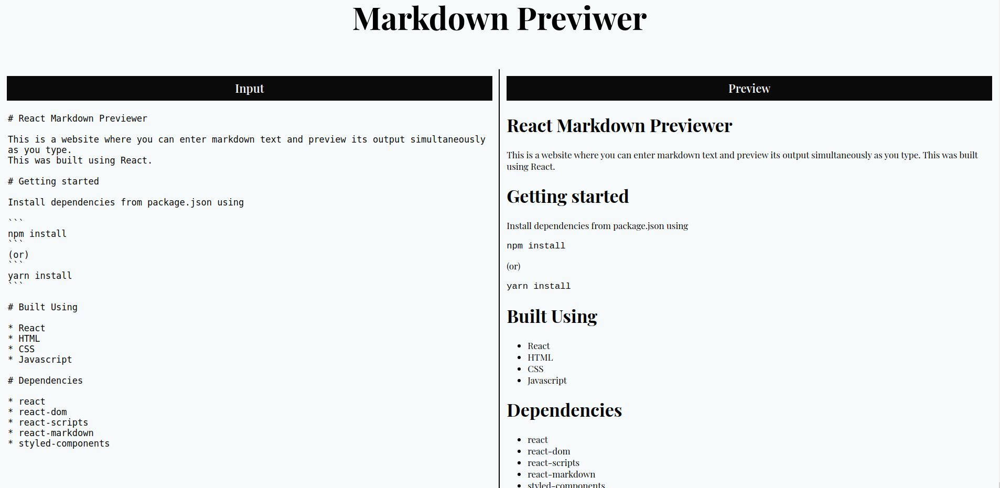

# React Markdown Previewer



This is a website where you can enter markdown text and preview its output simultaneously as you type. 
This was built using React.

# Getting started

Install dependencies from package.json using

```
npm install
```
(or)
```
yarn install
```

# Built Using

* React
* HTML
* CSS
* Javascript

# Dependencies

* react
* react-dom
* react-scripts
* react-markdown
* styled-components
